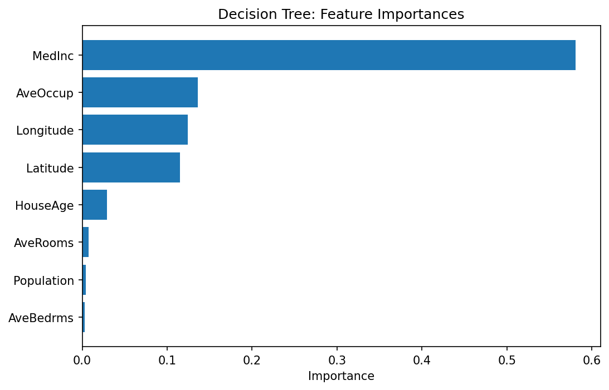

**Name:** Felix  
**Gruppe:** 308  
**Zeitraum:** 20.02.2026 – 15.04.2026

---

## Anleitung

Ein Eintrag enthält mindestens:
- **Datum**
- **Titel** (kurz und prägnant)
- **Arbeitsschritte** (stichpunktartig ist ausreichend)
- Verweis auf das Gruppentreffen, aus dem die Aufgabe hervorgegangen ist
- Ggf. Abweichungen vom vereinbarten Vorgehen (mit Begründung)

Screenshots im Logbuch sind erlaubt. Abbildungen müssen nicht vollständig ausgearbeitet sein.

---

## Eintrag 1

**Datum:** 20.02.2026 
**Titel:** Projektstart — Aufgabe lesen, Repository einrichten  
**Aus Gruppentreffen:**  [1] (20.02.2026)

**Arbeitsschritte:**
- Aufgabenstellung gelesen und verstanden 
- Repository geklont, Packages installiert (`pip install -r requirements.txt`)
- `nbstripout --install` eingerichtet
- Erste Übersicht über den California Housing Datensatz verschafft
  (`fetch_california_housing()`, 8 Features, Zielvariable: `MedHouseVal`)
- Besprechung allgemeines Vorgehen
- Einlesen in verschiedene Formen des NN
  - verknüpfen Vorlesungsinhalte mit Implimentationen im Notebook
- einrichten Github zum Austausch der Inhalte
**Entscheidungen:**
- 

**Schwierigkeiten / offene Fragen:**
- _z.B. Frage zu Hyperparameter-Wahl bei NN_

---

## Eintrag 2 *(ca. 6 h)*

**Datum:** 17.03.2026 
**Titel:** [Allgemeine Einarbeitung]  
**Aus Gruppentreffen:** [4, 5]

**Arbeitsschritte:**
- Vorbereitung VS-Code 
- Versuch Codeausführung mit bereits eingerichtetem KI1-Environment 
- Neuinitialisierung Python environment 
  - Pakete installiert 
  - Problemlösen Tensorflow
  
- Einlesen in neuste Änderungen der Gruppenmitglieder
- Aufarbeitung Vorlesungsinhalte
- einarbeitung in Git 
- Gruppentreffen 5 (siehe Gruppentreffen)
  - Absprache zur Zeitaufteilung und Bearbeitung der NN
- logbuch angelegt 
- Recherche allgemein zu vorgehen beim Aufbau neuronaler Netze
- Ausarbeitung zu Ideen zu:
  - random search, grid search, Datentransformation, drop out und weigth decay
- Einlesen in Fachliteratur, inbesondere: [Stuart J. Russell, Peter Norvig (2020-4th Ed.): Artificial Intelligence: A Modern Approach, Prentice Hall]
**Entscheidungen:**
- Python 3.11.15 verwenden 
- Absprache mit Björn zur Zusammenfassung und weiteren Optimierung der NN von Kolja und Felix H.
  
**Schwierigkeiten / offene Fragen:**
- Python environment (gelöst)

---

## Eintrag 3 *(ca. 8h)*

**Datum:** [19.03.2026]  
**Titel:** [begin Bayesianische Optimierung]  
**Aus Gruppentreffen:** [5]

**Arbeitsschritte:**
- Zusammenfassung NN Felix H. für mein Vorgehen
  - Konzentration auf Features nach Einfluss auf das Modell (siehe Abbildung Feature importances)
  - 
    - durch decisiontree herausgearbeiteter Einfluss der Features bei Bearbeitung berücksichtigen
  - Im Sinne der Konvergenzzeit auf die wichtigesten Features zur Beschreibung des Datensatzes nutzen
    - gegebenenfalls einzele dieser Features zusammenfassen und weiter experimentieren 
- Suche nach Optimierung mit grid- und random search
  - Erkenntnis: Felix H. schon sehr viel inklusive ensemble ausprobiert
  - effizientere Suche durch Bayesianische Optimierung
    - Idee dabei: durch geschickte Beobachtung des Lernvorganges abschätzen, ob dieser zielführend ist, oder nicht
    - gegebenenfalls wird nach weniger als der maximalen Epochenzahl abgebrochen, um Rechenzeit zu sparen
- Begin Implimentierung mit Keras tuner model 
- #Quelle: Luca Invernizzi, James Long, Francois Chollet, Tom O'Malley, Haifeng Jin (2019): Getting started with KerasTuner https://keras.io/keras_tuner/getting_started/

  - [build_tuner_model()] erstellt ein sequenzielles Model über Keras-Paket: "https://keras.io/guides/sequential_model/"  
    - zunächst einfaches Modell zur sauberen Implimentierung der Bayes Idee
- direkte Einbindung des Dropout (aus Erkenntnissen der anderen NN)
- im Sinne des vanishing gradient und der gefahr des overfittings zunächst kein sehr tiefes Netz
- zweiter Versuch mit mehr zugelassener Breite (bis 256 Neuronen pro Layer)
- bei NN- Architektur an Erkenntnissen aus 05_Neural_Network_Felix.ipynb orientieren
  - geringe Tiefe, variable Breite 
  - start learning rate 0.001
  - Verwendung der vorbereiteten Datenbereinigungen und Skalierungen [load_and_clean_data()]

**Entscheidungen:**
- Pythonumgebung auf 3.10.20 für gute tensorflowpermoance downgraden
- bayesianische Optimierung zunächst einfach mit sequenziellem Modell 

**Schwierigkeiten / offene Fragen:**
- Probleme beim installieren von keras.tuner
  - 1,5h bugfixing und zweifach neues Aufsetzen des Environments 
  - downgrade auf python 3.10.20 half

---

## Eintrag 4 *(ca. 8h)*

**Datum:** [20.03.2026]  
**Titel:** [fortsetzung Implimentierung Bayesianische Optimierung]  
**Aus Gruppentreffen:** [5]

**Arbeitsschritte:**
- gestrige Idee weiter implimentiert 
- Entscheidung für optimizer adam 
  - "generell zunächst basis Einstellungen Nutzen und dann komplexeres ausprobieren"
- Möglichkeit zu hinzufügen eines weiteren Layers einprogrammiert
- Probleme beim einbau des Learning rate Scheduler (*gelöst)
  - nun dynamische Anpassung der learning rate (Standartvorgehen)-> führt zu Performancesteigerung 
- Implimentierung des Ensembles. auch zuvor schon deutliche verbesserung gegenüber Einzelmodel
  - Nun sowohl stärkstes Einzelmodell, als auch ensemble der stärksten Modelle im Vergleich
- hinzufügen  num_initial_points=5 in tuner 
- Hinzufügen "Bedrooms_per_Room" als Feature in eingelesenen Daten
- vorläufig bestes Ergebnis mit R^2-score= 0.7925
**Entscheidungen:**
- adam optimizer 
- weitere Experimente mit Optimizer zu späterem Zeitpunkt 
- neues Feature durch hinzufügen:  "Bedrooms_per_Room" = "AveBedrms"/"AveRooms" 
  - zunächst keine Verbesserung
- Versuch durch erneute Reduktion der Layer und Erhöhung der Breite auf <= 512 Neuronen Performance zu erhöhen
  - R^2 = 0.7897
- hinzufügen leaky_relu zu möglichen Aktivierungsfunktionen
  - leaky relu setzt Werte <0 im Gegensatz zu Relu nicht auf Null, sodass diese oftmals "absterben" (Dying Relu Problem)
- Werte mit sehr geringer Steigung kommen hie rnoch durch und der Informationsfluss bleibt bestehen
**Schwierigkeiten / offene Fragen:**
- Implimentierung des LR-Scheduler (*gelöst)
- R^2 über 0.8 mit diesen Mitteln erreichbar?
- Verschiebung des Speicherortes hochwertiger Modelle

**Erkentnis:**
- alles in allem gleiche performance wie bei random- und grid search mit drastisch reduzierter rechenzeit
- kein besserer R^2 durch hinzufügen eines weiteren features
- ebenfalls keine Verbesserung durch Berücksichtigung Leaky elu
- 
---

## Eintrag 5 *(ca. 4h)*

**Datum:** [21.03.2026]  
**Titel:** [neue geologische Features]  
**Aus Gruppentreffen:** [5]

**Arbeitsschritte:**
Experiment:
   Implimentierung der Features 'Lat_x_Lon', 'Dist_to_SF', 'Dist_to_LA'
  - Koordinaten in Longitude und Latidude als Kombinations
    - Die Idee dahinter: Aus eigener Erfahrung bekannt, dass LA und SF absolut größte Zentren und entscheidend für Wirtschaft in Kalifornien
    - Eine Orientierung in Abhängigkeit der Distanz zu beiden Zentren könnte helfen Preise exakter zu beschreiben
  - Ziel: R^2>=0.8 (Berücksichtigung des Loss und der Residuen)
      - Betrachtung darf nie nur im Sinne des R^2 getroffen werden
  - Resultat: nach zwei durchläufen keine Erkennbare Verbesserung (Ziel vorest verfehlt)
- Bestes Ergebnis bisher: 
**Entscheidungen:**
Keine Blinde Untersuchung mit neuen Features mehr. AEs wird auch mit den neuen features ein random forest zur Untersuchung der feature importance durchgeführt. 
**Schwierigkeiten / offene Fragen:**

**Erkentnis:**
Auch die Einführung der geografischen Features, bringt keine direkte Verbesserung des Modells hinsichtlich der Konvergenz und des R^2-Values. Das impliziert jedoch keine Nutzlosigkeit für das Modell insgesamt, da auch kein Nachteil festgestellt werden kann. 
---

## Eintrag 6 *(ca. 6h)*

**Datum:** [22.03.2026]  
**Titel:** [Random Forest]  
**Aus Gruppentreffen:** [5]

**Arbeitsschritte:**
- Wie in Gruppentreffen 5 besprochen Random Forest zur feature importance Analyse
- Random Forest Zelle schreiben
  - scikit.learn RandomForestRegressor
  - Zunächst sicherstellen, dass y_train richtige size hat 
    - Nutzung von [isinstance()]
  - n_jobs=-1 beschleunigt Rechnung durch Nutzung aller zur Verfügung stehender Kerne
  - Skalierung der Daten für Random Forest irrelevant 
  - Darstellung der importances durch Balkendiagramm 
**Erkentnis:**
Untersuchung der Featureimportance (zu sehen auf folgendem Plot: .png>)) zeigt auf, dass popolation und auch die zuvor etwas vielversprechender wirkende log_population, wenig Einfluss auf das NN haben. Es kann davon ausgegangen werden, dass ihr Rauschen die postiven Effekte aufhebt.

**Entscheidungen:**
- NN ohne Population trainieren
**Schwierigkeiten / offene Fragen:**
- Zunächst Fehler der eingesetzen Daten aufgrund deren Umfangs. Gelöst durch erneutes Laden der Daten (manchmal kann es einfach sein)
- Berechnungszeit vor n_jobs deutlich länger 

## Eintrag 7 *(ca. h)*

**Datum:** [23.03.2026]  
**Titel:** [Interpretation bisheriger Ewrkenntnisse]  
**Aus Gruppentreffen:** [5]

**Arbeitsschritte:**
- Die gestrige Entscheidung das NN ohne die Poplationsfeatures zu trainieren, da diese dem Random Forest zur Folge am schwächsten abschneiden, wurde ausgeführt
  - Das ernüchternde Ergebnis: zwar ist das Netz deutlich schneller konvergiert, doch lag der R^2 "nur" noch bei circa 0.783.
- KI Prompt: "Ab welcher Gini Importance lohnt es ein Feature für das Training eines Neuronalen Netzes zu vernachlässigen?"
  - Das Sprachmodell Gemini erklärt, dass bei einer Feature importance von deutlich unter einem Prozent das Rauschen dem Informationsgewinn überwiegt. 
  - Aus dem Ergebnissen der Feature Importance analyse (.png>)) folgt, dass einige Features zwar einen relativ geringen, in Summe aber nicht zzu vernachlässigenden Beitrag liefern. Neuronale Netze sind in der Lage auch aus kleinen Signalen Muster zu filtern und profitieren hierbei auch von solceh Signalen, insbesondere wenn es um die letzen Performanceprozent geht.
- Die geringe Hilfe der neuen Features wird auch durch eine Betrachtung der Korrelationsanalyse ersichtlich: .  

- Besprechung mit Björn 
  - Besprechung der bisherigen Ergebnisse
    - Erkenntnisgewinn aus Training der neuronalen Netze ausgetauscht 
    - mit Stand der anderen Gruppenmitglieder verglichen
  - Aufteilung des weiteren Vorgehens
    - Wer fasst welches Notebook zusammen?
  - Besprechung der Ergebnisse bei Gruppentreffen am 26.03
- 
- Implimentierung einer Latex Arbeitsumgebung in VS-Code
  - installation der notwendigen Pakete
  - einarbeiten in die Tau-class
  - Modifikation des Gitignore 
      

**Erkentnis:**
- Eine Beschneidung der Features ist zunächst nicht ratsam und führt zu Performanceminderung.
- Letzlich haben sind die neuen Featureideen als nicht nützlich herausgestellt.
- Latex in VSCode zu implimentieren ist nicht ganz einfach
**Entscheidungen:**

**Schwierigkeiten / offene Fragen:**
- Kann durch Featureoptimierung das Neuronale Netz mit meinen Parametermöglichkeiten über R^2 = 0.8 steigen?
- Schwierigkeiten Latex auf VS-Code zum laufen zu bringen
- ständig neues Auftauchen der Latexhilfsdateien in gitchanges trotz gitignore
- 